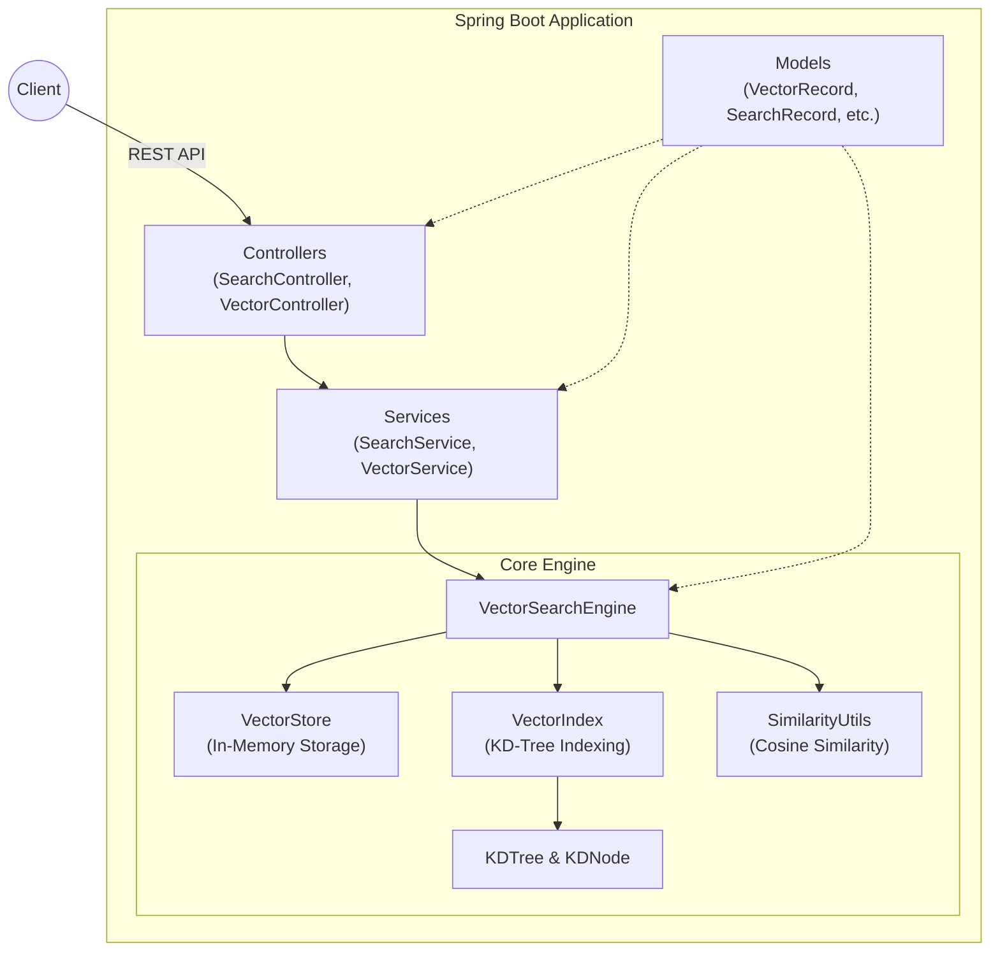

# Vector DB Project

This is a simple vector database implementation using Spring Boot. It allows you to store and search for high-dimensional vectors, leveraging a KD-Tree structure for efficient similarity searches.

## Architecture

The project is structured into several layers: Controllers for API endpoints, Services for business logic, an Engine for the core vector storage and search algorithms, and Models for data representation.



## Core Components

### 1. Controllers (`com.example.vector_db.controller`)
*   **`VectorController`**: Handles REST endpoints for adding, updating, retrieving, and deleting vectors in the database.
*   **`SearchController`**: Handles REST endpoints for performing similarity searches against the stored vectors.

### 2. Services (`com.example.vector_db.service`)
*   **`VectorService`**: Manages the business logic for vector operations, acting as a bridge between the Controller and the core Engine.
*   **`SearchService`**: Manages the business logic for executing search requests and formatting the results.

### 3. Engine (`com.example.vector_db.engine`)
This is the core of the vector database, responsible for storage, indexing, and search algorithms.
*   **`VectorStore`**: Manages the raw, in-memory storage of `VectorRecord` objects.
*   **`VectorIndex`**: Manages the indexing structure to allow for fast searches.
*   **`KDTree` & `KDNode`**: Implement a K-Dimensional Tree data structure. This is used to partition the vector space, drastically reducing the number of comparisons needed during a search (compared to a brute-force approach).
*   **`VectorSearchEngine`**: Orchestrates the search process. It takes a query vector, traverses the `KDTree` to find the nearest neighbors, and uses `SimilarityUtils` to rank them.
*   **`SimilarityUtils`**: Contains mathematical utility functions, notably the calculation of **Cosine Similarity**, which is used to determine how "close" or similar two vectors are.

### 4. Models (`com.example.vector_db.model`)
*   **`VectorRecord`**: Represents a single data point in the database, containing an ID, the high-dimensional vector itself (a list of numbers), and associated metadata.
*   **`SearchRequest`**: A payload object representing a user's search query (containing the query vector and parameters like 'k' nearest neighbors).
*   **`SearchRecord` & `SearchResult`**: Objects used to bundle a `VectorRecord` with its calculated similarity score to be returned to the client.

## Features

*   **Vector Storage**: Store vectors with associated metadata.
*   **Efficient Similarity Search**: Utilizes a KD-Tree index and Cosine Similarity to quickly find the most relevant vectors.
*   **REST API**: A simple RESTful API for interacting with the vector database.
*   **Swagger Documentation**: API documentation is readily available.

## Getting Started

### Prerequisites

*   Java 21
*   Gradle

### Building the Project

To build the project, run the following command in the root directory:

```bash
./gradlew build
```

### Running the Application

You can run the application using the following command:

```bash
./gradlew bootRun
```

The application will be available at `http://localhost:8080`.

## API Documentation

Once the application is running, you can access the Swagger UI for API documentation at:

[http://localhost:8080/swagger-ui.html](http://localhost:8080/swagger-ui.html)
